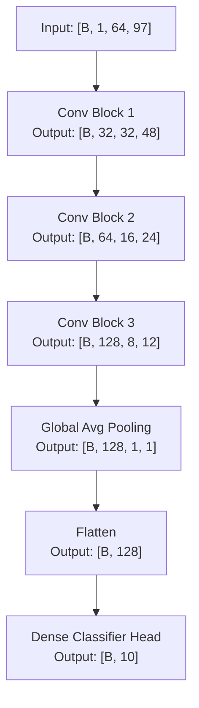

# STREAMSENSE Model Card (MPIC v1.0 & NSP v1.2)

This Model Card details the architecture, training details, input/output contracts, normalization statistics, evaluation results, quantization workflow, regression suites, and network streaming details for the **STREAMSENSE** command recognition model.

The preprocessing pipeline, tensor specifications, and validation rules conform to the **Model & Preprocessing Interface Contract (MPIC) v1.0** frozen specification. The network streaming protocol conforms to the **Network Streaming Protocol (NSP) v1.2** frozen specification.

---

## 1. Overview
* **Model Name:** StreamSenseNet
* **Task:** 10-Class Keyword Spotting (KWS) / Command Recognition
* **Input Signal:** 1.0 second of raw PCM audio (16 kHz, mono, float32)
* **Preprocessed Representation:** Log-mel spectrogram of shape `[1, 1, 64, 97]`
* **Outputs:** 10-class raw logits of shape `[1, 10]`
* **Format:** ONNX Opset 17 (FP32 & Quantized QDQ INT8)
* **Deployment Deliverables:** Self-contained deployment package generated via [assemble_deployment_package.py](file:///c:/STREAMSENSE/training/assemble_deployment_package.py)
* **MPIC Version:** 1.0 (Frozen)
* **NSP Version:** 1.2 (Frozen)

---

## 2. Model Architecture
`StreamSenseNet` is a compact, custom 2D Convolutional Neural Network (CNN) designed for low-latency command recognition. It contains **295,786** total parameters (all of which are trainable) and employs a VGG-style structure with three convolutional blocks followed by Global Average Pooling (GAP) and a dense classifier head.

### Spatial Shape Evolution (Batch size $B$)


### Layer Details
1. **Convolution Block 1 (Channels: 1 &rarr; 32):**
   * Conv2D (filters=32, kernel=3x3, stride=1, padding=1, bias=False) &rarr; BatchNorm2D &rarr; ReLU
   * Conv2D (filters=32, kernel=3x3, stride=1, padding=1, bias=False) &rarr; BatchNorm2D &rarr; ReLU
   * MaxPool2D (kernel=2x2, stride=2)
   * Spatial Dropout2D ($p = 0.25$)
   * *Output Shape:* `[B, 32, 32, 48]`
2. **Convolution Block 2 (Channels: 32 &rarr; 64):**
   * Conv2D (filters=64, kernel=3x3, stride=1, padding=1, bias=False) &rarr; BatchNorm2D &rarr; ReLU
   * Conv2D (filters=64, kernel=3x3, stride=1, padding=1, bias=False) &rarr; BatchNorm2D &rarr; ReLU
   * MaxPool2D (kernel=2x2, stride=2)
   * Spatial Dropout2D ($p = 0.25$)
   * *Output Shape:* `[B, 64, 16, 24]`
3. **Convolution Block 3 (Channels: 64 &rarr; 128):**
   * Conv2D (filters=128, kernel=3x3, stride=1, padding=1, bias=False) &rarr; BatchNorm2D &rarr; ReLU
   * Conv2D (filters=128, kernel=3x3, stride=1, padding=1, bias=False) &rarr; BatchNorm2D &rarr; ReLU
   * MaxPool2D (kernel=2x2, stride=2)
   * Spatial Dropout2D ($p = 0.25$)
   * *Output Shape:* `[B, 128, 8, 12]`
4. **Global Average Pooling (GAP):**
   * Collapses spatial grid `8x12` &rarr; `1x1` per feature map to reduce overfitting and lower parameters.
   * *Output Shape:* `[B, 128, 1, 1]` (flattened to `[B, 128]`).
5. **Dense Classifier Head:**
   * Fully Connected (`Linear(128, 64)`) &rarr; ReLU
   * Dropout ($p = 0.50$)
   * Fully Connected (`Linear(64, 10)`) &rarr; Logits
   * *Output Shape:* `[B, 10]`

### Weight Initialization Details
* **Conv2d Layers:** Kaiming (He) normal initialization with gain optimized for ReLU (`mode="fan_out"`, `nonlinearity="relu"`). Conv bias parameters are disabled/omitted since they are followed by batch normalization.
* **BatchNorm2d Layers:** Weight initialized to `1.0` (scale) and bias initialized to `0.0` (shift).
* **Linear Layers:** Default PyTorch initializers (adequate for layers of this scale).

---

## 3. Dataset & Augmentations
* **Source Dataset:** Google Speech Commands v2 (10 Selected Command Classes).
* **Train Split Size:** 26,984 files.
* **Test Split Size:** 5,779 samples.
* **Data Augmentations (Training Only):**
  * *Time-Domain (applied in [dataset.py](file:///c:/STREAMSENSE/training/dataset.py)):*
    * **Circular Time Shift:** Random circular shift by up to $\pm20\%$ of frame length ($\pm3200$ samples).
    * **Additive Gaussian Noise:** Gaussian noise added to the signal with standard deviation $\sigma = 0.005$.
    * **Amplitude Scaling:** Waveform scaled by a random amplitude scaling factor uniformly sampled from $[0.8, 1.2]$.
  * *Spectral-Domain (SpecAugment, applied to batch in [train.py](file:///c:/STREAMSENSE/training/train.py)):*
    * **Frequency Masking:** 1 random mask masking up to $F=8$ mel bins (out of 64).
    * **Time Masking:** 1 random mask masking up to $T=15$ time frames (out of 97).
    * **Mask Fill Value:** Masked regions are filled with `0.0` (the mean value of the normalized feature space).

---

## 4. Input/Output Contract
Runtime audio and model inputs must conform to the following specifications:
* **Audio Format:** PCM Mono, 16 kHz sample rate, float32 encoding.
* **Signal Window:** Exactly 1.0 second (16,000 samples). Padding with trailing zeros or cropping must be done if input signal length varies.
* **Input Tensor Name:** `"input"`
* **Input Tensor Shape:** `[1, 1, 64, 97]` (representing `[Batch, Channel, Mel Bins, Time Frames]`).
* **Input Tensor Dtype:** `float32`.
* **Output Tensor Name:** `"logits"`
* **Output Tensor Shape:** `[1, 10]`.
* **Output Tensor Dtype:** `float32` (identical shapes, names, and formats for FP32 and INT8 models, QDQ operations are internal).

---

## 5. Feature Extraction Pipeline
The canonical preprocessing sequence follows a 9-step pipeline. Any cross-implementation (e.g., C++) must match these steps exactly:

1. **Format Validation:** Accept float32 audio samples as 1D array `[T]` or 2D `[C, T]`.
2. **Channel Reduction:** Downmix stereo to mono by taking the mean across channels (`waveform.mean(dim=0, keepdim=True)`).
3. **Temporal Framing:** Pad with zeros on the right or crop on the right to achieve exactly 16,000 samples.
4. **Mel Spectrogram:** Extract mel-scaled power spectrogram using periodic Hann windowing:
   * $N_{FFT} = 512$
   * $\text{Hop Length} = 160$ samples (10 ms stride)
   * $N_{Mel} = 64$ bins
   * $\text{Center} = \text{False}$ (Critical to achieve exactly $T=97$ frames, matching $(16000 - 512) / 160 + 1$)
   * $\text{Power} = 2.0$
5. **Logarithmic Scaling:** Compute $10 \cdot \log_{10}(\text{mel} + 10^{-10})$ with an epsilon floor of $10^{-10}$.
6. **Dynamic Range Clamping:** Clamp values to a lower bound of $-80.0\text{ dB}$.
7. **Global Normalization:** Standardize features: $\text{Normalized} = (\text{Mel}_{db} - \mu_{global}) / \sigma_{global}$.
8. **Channel/Batch Dimension Expansion:** Reshape array to `[1, 1, 64, 97]`.
9. **Dtype Assertion:** Assert final shape is `(1, 1, 64, 97)` with `float32` precision.

---

## 6. Normalization Statistics
Precomputed over the full training split of 26,984 files:
* **Global Mean ($\mu_{global}$):** `-30.785544706009965` dB (Spec constant: `-30.785545` dB)
* **Global Std ($\sigma_{global}$):** `22.157099125788548` dB (Spec constant: `22.157099` dB)
* **Verification:** Standard deviation is verified to be strictly positive ($>0.0$) in code to avoid division-by-zero errors.

---

## 7. Output Classes
Logit array index mapping from [class_labels.json](file:///c:/STREAMSENSE/class_labels.json):

| Index | Label | Type | Description |
| :---: | :---: | :---: | :--- |
| **0** | yes | Command | Affirmative response |
| **1** | no | Command | Negative response |
| **2** | up | Direction | Move upward / increase |
| **3** | down | Direction | Move downward / decrease |
| **4** | left | Direction | Move leftward |
| **5** | right | Direction | Move rightward |
| **6** | on | State | Activate system / power-on |
| **7** | off | State | Deactivate system / power-off |
| **8** | stop | Command | Immediate halt |
| **9** | go | Command | Proceed / execute |

---

## 8. Performance Metrics
Evaluation metrics on the test split (5,779 samples) from [evaluation_report.txt](file:///c:/STREAMSENSE/evaluation/evaluation_report.txt):

### General Classification Performance (FP32 Model / PyTorch Checkpoint)
* **Trained Epochs:** 26
* **Validation Accuracy:** 96.11%
* **Test Loss:** 0.1273
* **Overall Test Accuracy:** 95.97% (5,546 / 5,779 samples)

### Per-Class Report
| Class | Precision | Recall | F1-Score | Support | Accuracy |
| :--- | :---: | :---: | :---: | :---: | :---: |
| **yes** | 0.9884 | 0.9884 | 0.9884 | 606 | 98.84% (599/606) |
| **no** | 0.9581 | 0.9679 | 0.9630 | 591 | 96.79% (572/591) |
| **up** | 0.8736 | 0.9517 | 0.9110 | 559 | 95.17% (532/559) |
| **down** | 0.9770 | 0.9404 | 0.9583 | 587 | 94.04% (552/587) |
| **left** | 0.9839 | 0.9667 | 0.9752 | 570 | 96.67% (551/570) |
| **right** | 0.9929 | 0.9929 | 0.9929 | 566 | 99.29% (562/566) |
| **on** | 0.9822 | 0.9566 | 0.9692 | 576 | 95.66% (551/576) |
| **off** | 0.9107 | 0.9447 | 0.9274 | 561 | 94.47% (530/561) |
| **stop** | 0.9927 | 0.9380 | 0.9646 | 581 | 93.80% (545/581) |
| **go** | 0.9452 | 0.9485 | 0.9468 | 582 | 94.85% (552/582) |
| **Macro Avg** | **0.9605** | **0.9596** | **0.9597** | **5779** | **-** |
| **Weighted Avg** | **0.9610** | **0.9597** | **0.9600** | **5779** | **-** |

### Confusion Matrix (Rows = Ground Truth, Columns = Predicted)
```
         yes   no   up  down left right   on  off stop   go
yes    [[599,   1,   1,   0,   1,   0,   0,   2,   0,   2],
no      [  1, 572,   4,   3,   1,   1,   0,   0,   1,   8],
up      [  0,   0, 532,   0,   0,   0,   0,  24,   0,   3],
down    [  1,   9,   4, 552,   1,   1,   4,   0,   2,  13],
left    [  2,   7,   5,   0, 551,   1,   0,   4,   0,   0],
right   [  0,   0,   1,   0,   3, 562,   0,   0,   0,   0],
on      [  0,   1,   6,   2,   1,   1, 551,  14,   0,   0],
off     [  0,   0,  26,   0,   0,   0,   3, 530,   0,   2],
stop    [  0,   0,  22,   2,   0,   0,   2,   6, 545,   4],
go      [  3,   7,   8,   6,   2,   0,   1,   2,   1, 552]]
```

---

## 9. Quantization Workflow (FP32 &rarr; INT8)
The quantization workflow is detailed in the post-training quantization notebook [quantize_ptq.ipynb](file:///c:/STREAMSENSE/onnx_models/quantize_ptq.ipynb):
* **Quantization Method:** Post-Training Static Quantization (PTQ) via ONNX Runtime.
* **Calibration Set Size:** 1000 samples randomly drawn from the `train` split (fixed seed `42` for reproducibility).
* **Quantization Format:** Quantize-Dequantize (`QuantFormat.QDQ`) linear quantization. Model input/output layers remain float32 for pipeline compatibility.
* **Granularity:** Per-tensor quantization (`per_channel=False`).
* **Quantized Node Types:** Weights (`QuantType.QInt8`) and activations (`QuantType.QInt8`).

### Parity & Accuracy Degradation Checks
* **Parity on Hand-picked GVs:** 10/10 PASS (all top-1 predictions match FP32).
* **GV Logit Difference (Max absolute discrepancy):**
  * GV_00_yes: logit_diff=0.2975
  * GV_01_no: logit_diff=0.3824
  * GV_02_up: logit_diff=0.1134
  * GV_03_down: logit_diff=0.2378
  * GV_04_left: logit_diff=0.4012
  * GV_05_right: logit_diff=0.1849
  * GV_06_on: logit_diff=0.2085
  * GV_07_off: logit_diff=0.1167
  * GV_08_stop: logit_diff=0.1990
  * GV_09_go: logit_diff=0.1372
* **Quick Validation (200 val samples):** FP32 Accuracy `99.00%`, INT8 Accuracy `99.00%` (0.00% drop).

---

## 10. Quantization Results Summary
A comparative analysis between FP32 and PTQ QDQ INT8 configurations on the test set:

* **Size Reduction:** **73.56% smaller footprint** (~$3.8\times$ compression ratio).
  * FP32 model size: `1,185,096` bytes (~`1.13` MB)
  * INT8 model size: `313,302` bytes (~`305.96` KB)
* **Inference Speedup:** **$8.29\times$ speed improvement** on target CPU (10.1s vs 83.7s for 5779 samples, equivalent to ~1.75 ms vs 14.48 ms per sample).
* **Accuracy Drop:** **$0.10\%$** (10 basis points) on the full 5779 test samples, well within the $1.0\%$ max drop budget.

### Per-Class Comparison (Accuracy %)
| Class | FP32 Accuracy | INT8 Accuracy | Delta (%) |
| :--- | :---: | :---: | :---: |
| **yes** | 98.84% | 98.84% |  0.00% |
| **no** | 96.79% | 96.62% | -0.17% |
| **up** | 95.17% | 95.89% | +0.72% |
| **down** | 94.04% | 94.21% | +0.17% |
| **left** | 96.67% | 96.32% | -0.35% |
| **right** | 99.29% | 99.12% | -0.17% |
| **on** | 95.66% | 95.66% |  0.00% |
| **off** | 94.47% | 93.76% | -0.71% |
| **stop** | 93.80% | 93.46% | -0.34% |
| **go** | 94.85% | 94.67% | -0.18% |
| **Overall** | **95.97%** | **95.86%** | **-0.11%** |

*Note: The quantized model slightly outperformed the FP32 model on the directional `up` and `down` classes, likely due to quantization noise serving as a form of regularizing noise.*

---

## 11. Golden Vector Validation & Regression
The preprocessing and inference pipeline are validated via two regression sets:

### A. Hand-picked Golden Vector Parity (10 Vectors)
* **Validation Script:** [verify_pipeline.py](file:///c:/STREAMSENSE/training/verify_pipeline.py)
* **Source Directory:** `golden_vectors/` (1 raw, 1 mel spectrogram, 1 normalized spectrogram per class)
* **Numeric Parity Requirements:**
  * Same-implementation (Python vs Python) Max Absolute Error limit: **$1 \cdot 10^{-4}$**
  * Cross-implementation (Python vs C++) Max Absolute Error limit: **$5 \cdot 10^{-4}$**
* **Verification Status:** **PASS** (maximum absolute error of `0.000000e+00` for both Stage 1 and Stage 2 checks).

### B. Large-scale GV Regression (1000 Vectors)
* **Validation Script:** [run_gv_regression_1000.py](file:///c:/STREAMSENSE/training/run_gv_regression_1000.py)
* **Source Directory:** `golden_vectors_1000/` (stratified 100 samples per class randomly drawn from the `test` split, seeded at `42`).
* **Parity Tolerance:** $5 \cdot 10^{-4}$ (`0.0005`).
* **FP32 Model Regression Results:** **PASS** (1000/1000 pipeline parity matches, `0.00e+00` worst-case error, `95.90%` model prediction accuracy).
* **INT8 Model Regression Results:** **PASS** (1000/1000 pipeline parity matches, `0.00e+00$ worst-case error, `95.90%` model prediction accuracy).
* **Parity Degradation:** `0.00%` accuracy drop between FP32 and INT8 models on the regression set.
* **Integration Acceptance Gate:** **OPEN** (Verified ready for production deployment).

---

## 12. Network Streaming Protocol (NSP v1.2)
To facilitate low-latency production deployment, the model incorporates NSP v1.2 streaming support via [nsp_protocol.py](file:///c:/STREAMSENSE/training/nsp_protocol.py):
* **Connection Profile:** TCP sockets with `TCP_NODELAY = 1` (Nagle algorithm disabled to eliminate network buffering latency).
* **Dual-Role Wrapper:** [nsp_node.py](file:///c:/STREAMSENSE/training/nsp_node.py) runs the receiver role in a background thread and the sender role in the main thread concurrently.
* **Packet Frame Structure on wire:**
```
+------------------------------------+--------------------------+-----------------------+
|  Length Prefix (LE uint32, 4 bytes)|    NSP Header (48 bytes) |    Payload (64000 B)  |
+------------------------------------+--------------------------+-----------------------+
```
* **NSP Header Struct Layout (`"<4sHBBQQQIIII"`, 48 bytes):**
  1. `magic` (4s): `b"NSP\0"` magic string
  2. `version` (H): Protocol version (`1` for NSP v1.2)
  3. `msg_type` (B): Message type (`0x01` = DATA, `0x02` = EOF)
  4. `dtype` (B): Payload datatype (`0x03` = FLOAT32)
  5. `sequence_no` (Q): 64-bit frame sequence number (starts at 0, +1 per DATA frame)
  6. `timestamp_us` (Q): Microsecond UNIX timestamp
  7. `session_id` (Q): Unique ID constant per connection session (derived from connect time)
  8. `payload_bytes` (I): Size of payload in bytes (`64000` for DATA, `0` for EOF)
  9. `sample_rate` (I): Sample rate of streamed audio (`16000`)
  10. `frame_length` (I): Streamed frame size (`16000` samples)
  11. `reserved` (I): Padding (`0`)

---

## 13. Deployment & Quick Prediction Tools
* **Voice Test Notebook:** [quick_predict.ipynb](file:///c:/STREAMSENSE/quick_predict.ipynb) implements a live mic recording and inference loop.
  * **Temporal Windowing:** Sliding window of 1-second (`16000` samples) shifted by 500 ms (`8000` samples, or 50% overlap).
  * **Confidence Verification:** Checks output softmax probability against a confidence threshold of `0.70`. Predictions scoring lower than `0.70` are flagged as `"unclear"`.
* **Deployment Packager:** [assemble_deployment_package.py](file:///c:/STREAMSENSE/training/assemble_deployment_package.py) automates structural directory aggregation of models, preprocessing functions, configuration JSON files, regression test manifests, and NSP scripts.

---

## 14. Limitations
* **Out-of-Distribution Command Handling:** The model does not include an "unknown" or "noise" class. Spoken commands or environmental sounds outside the 10-class vocabulary will be forced into one of the 10 output categories.
* **Rigid Temporal Bounds:** Features must be exactly 1.0 second duration (16,000 samples) at 16 kHz. Audio with different sample rates must be resampled, and longer speech inputs must use temporal windowing (e.g., sliding windows) to yield valid inferences.
* **Window Alignment Sensitivity:** For single-shot prediction, the keyword should be centered or fully contained in the 1-second segment. Keywords cut off at segment boundaries will see reduced recognition accuracy.

---

## 15. Release Status
* **Status:** **FROZEN** (MPIC v1.0 and NSP v1.2 specification boundaries are locked).
* **Pipeline Verification Gate:** **PASS / OPEN**.
* **Deployment Readiness:** Production-ready.

```
Track A (Python/PyTorch) Sign-Off: ______________ Date: __________
Track B (C++) Sign-Off:           ______________ Date: __________
```
